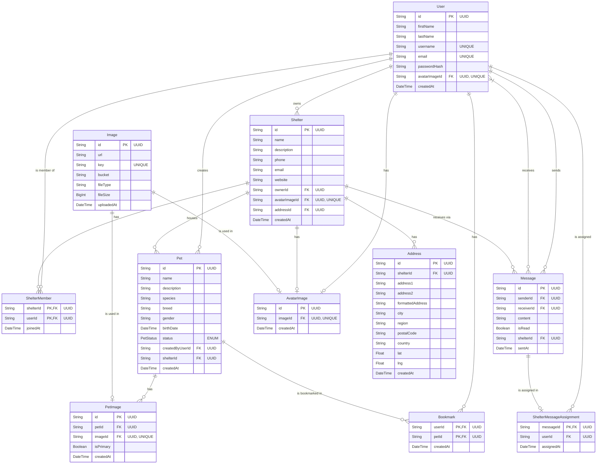

# PetConnect

## Database Entity Relation Diagram

```mermaid
erDiagram
    User ||--o{ Shelter : owns
    User ||--o{ ShelterMember : "is member of"
    User ||--o{ Pet : creates
    User ||--o{ Bookmark : has
    User ||--o{ Message : sends
    User }|--o{ Message : receives
    User ||--o{ ShelterMessageAssignment : "is assigned"
    User ||--o| AvatarImage : has

    Shelter ||--o{ ShelterMember : has
    Shelter ||--o{ Pet : houses
    Shelter ||--o{ Message : "receives via"
    Shelter ||--o| AvatarImage : has
    Shelter ||--o{ Address : has

    Pet ||--o{ PetImage : has
    Pet ||--o{ Bookmark : "is bookmarked in"

    Image ||--o| AvatarImage : "is used in"
    Image ||--o| PetImage : "is used in"

    Message ||--o| ShelterMessageAssignment : "is assigned in"

    User {
        String id PK "UUID"
        String firstName
        String lastName
        String username "UNIQUE"
        String email "UNIQUE"
        String passwordHash
        String avatarImageId FK "UUID, UNIQUE"
        DateTime createdAt
    }

    Shelter {
        String id PK "UUID"
        String name
        String description
        String phone
        String email
        String website
        String ownerId FK "UUID"
        String avatarImageId FK "UUID, UNIQUE"
        String addressId FK "UUID"
        DateTime createdAt
    }

    Address {
        String id PK "UUID"
        String shelterId FK "UUID"
        String address1
        String address2
        String formattedAddress
        String city
        String region
        String postalCode
        String country
        Float lat
        Float lng
        DateTime createdAt
    }

    ShelterMember {
        String shelterId PK,FK "UUID"
        String userId PK,FK "UUID"
        DateTime joinedAt
    }

    Pet {
        String id PK "UUID"
        String name
        String description
        String species
        String breed
        String gender
        DateTime birthDate
        PetStatus status "ENUM"
        String createdByUserId FK "UUID"
        String shelterId FK "UUID"
        DateTime createdAt
    }

    Image {
        String id PK "UUID"
        String url
        String key "UNIQUE"
        String bucket
        String fileType
        BigInt fileSize
        DateTime uploadedAt
    }

    AvatarImage {
        String id PK "UUID"
        String imageId FK "UUID, UNIQUE"
        DateTime createdAt
    }

    PetImage {
        String id PK "UUID"
        String petId FK "UUID"
        String imageId FK "UUID, UNIQUE"
        Boolean isPrimary
        DateTime createdAt
    }

    Bookmark {
        String userId PK,FK "UUID"
        String petId PK,FK "UUID"
        DateTime createdAt
    }

    Message {
        String id PK "UUID"
        String senderId FK "UUID"
        String receiverId FK "UUID"
        String content
        Boolean isRead
        String shelterId FK "UUID"
        DateTime sentAt
    }

    ShelterMessageAssignment {
        String messageId PK,FK "UUID"
        String userId FK "UUID"
        DateTime assignedAt
    }
```
